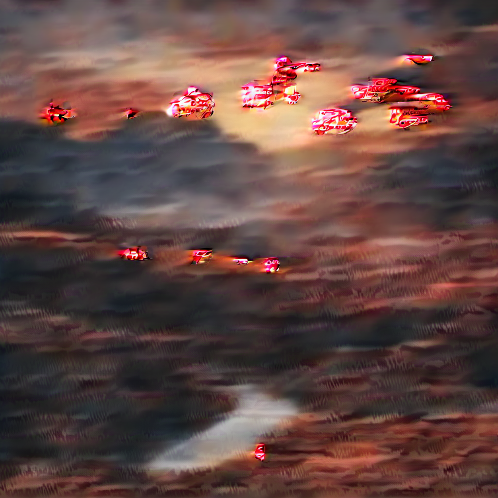
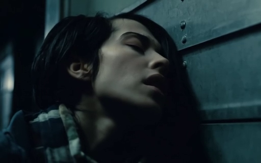
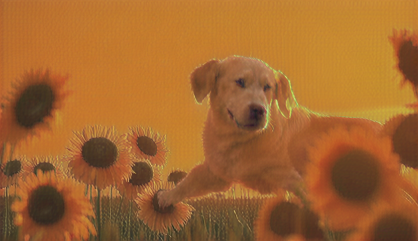
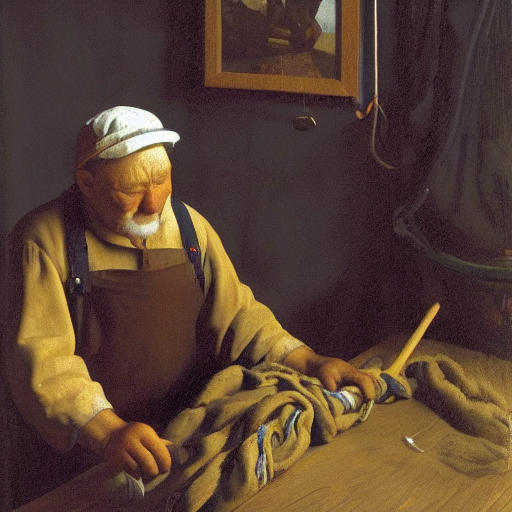
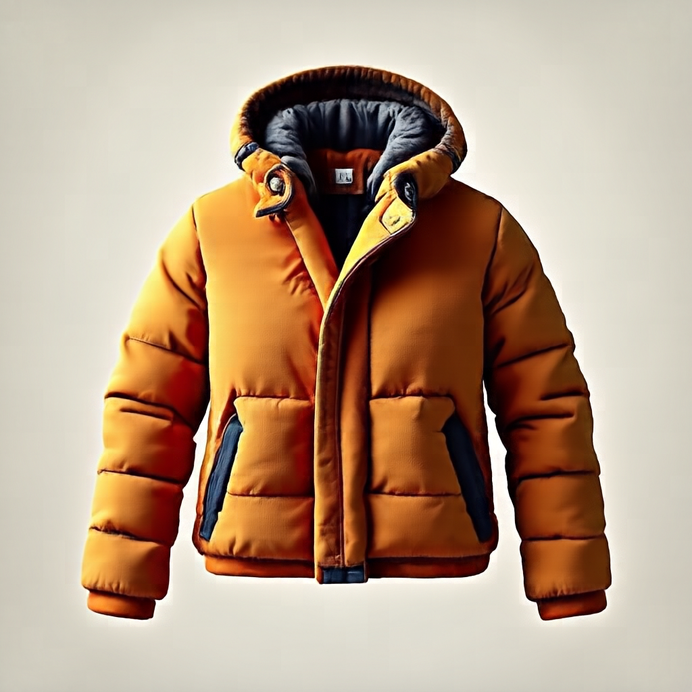
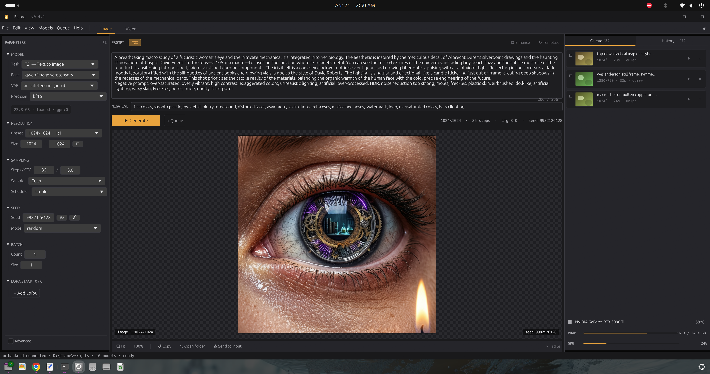

# inference-flame

Pure Rust diffusion model inference using [flame-core](https://github.com/CodeAlexx/Flame). No Python, no diffusers, no ONNX.

| Klein 9B | Z-Image | Anima 2B |
|---|---|---|
|  |  |  |
| *50 steps, CFG 4.0* | *8 steps, turbo* | *30 steps, CFG 4.5* |

| SDXL | Chroma 8.9B | QwenImage-2512 |
|---|---|---|
|  |  |  |
| *30 steps, CFG 7.5* | *40 steps, CFG 4.0* | *30 steps, CFG 4.0, 1024²* |

| SD3.5 Medium | ERNIE-Image 8B | LTX-2.3 Video |
|---|---|---|
|  |  |  |
| *28 steps, CFG 4.5, 1024²* | *28 steps, CFG 4.0, 1024²* | *10s video + audio — [sample.mp4](docs/ltx2_sample.mp4)* |

| FLUX.1-dev | Motif-Video 2B | SD 1.5 |
|---|---|---|
|  |  |  |
| *20 steps, guidance 3.5, 1024²* | *50 steps, APG cfg 8.0, 1280×720×49 @ 24fps — [sample.mp4](docs/motif_sample.mp4)* | *30 steps, CFG 7.5, 512², 58s* |

| Stable Cascade | SenseNova-U1 8B-MoT |  |
|---|---|---|
|  |  |  |
| *Stage C 30 + Stage B 20 steps, CFG 5.0/1.1, 1024², 93s — two-stage Würstchen v3 (Stage C prior + Stage B decoder + Paella VQ-GAN)* | *50 steps, CFG 4.0, shift 3.0, 1024², ~3.5 min on 3090 Ti via BlockOffloader* |  |

### Image editing — "change her dress to blue"

| Source | Klein 4B edit | Klein 9B edit | Qwen-Image-Edit-2511 |
|---|---|---|---|
|  |  |  |  |
| *reference image* | *35 steps, guidance 3.5, 1024², 477s* | *35 steps, guidance 3.5, 1024², 1006s (offloaded)* | *50 steps, true-CFG 4.0, 1024², ~23 min (offloaded)* |

https://github.com/CodeAlexx/inference-flame/raw/master/docs/ltx2_sample.mp4

https://github.com/CodeAlexx/inference-flame/raw/master/docs/motif_sample.mp4

## Performance

**Klein 9B Base (1024x1024, 50 steps, CFG 4.0, 3090 Ti 24GB)**

| Stage | PyTorch (block offload) | Flame (all on GPU) |
|---|---|---|
| Text Encode (Qwen3 8B) | 62s | 20s |
| Model Load | 62s | 19s |
| Denoise (50 steps) | 193s (3.86s/step) | 247s (4.94s/step) |
| VAE Decode | 1.9s | 7.7s |
| **Total** | **322s** | **295s** |

Denoise is **10% faster per-step** than PyTorch. Fits entirely on a single 24GB GPU without block offloading.

## Supported Models

| Model | Architecture | Status |
|---|---|---|
| FLUX.1-dev | Dual-stream DiT (19 double + 38 single blocks, 12B) | Working — BFL-parity 1024²/20, F32 RoPE PE, batched CFG, BlockOffloader |
| Klein 4B | Flux 2 DiT (5+20 blocks) | Working |
| Klein 9B | Flux 2 DiT (8+24 blocks) | Working |
| Z-Image | NextDiT (6.15B) | Working |
| Chroma 8.9B | FLUX-schnell DiT + distilled guidance (19+38 blocks) | Working — real CFG, 1024²/40 on a 24 GB card via BlockOffloader |
| SD3.5 Medium | MMDiT (24 blocks, dual attention) | Working — full prompt-to-PNG, CLIP-L + CLIP-G + T5-XXL, 1024² resident |
| SD3.5 Large | MMDiT (38 blocks) | Built, needs full pipeline |
| SDXL | LDM UNet | Working |
| SD 1.5 | UNet2DConditionModel (860M) + CLIP-L only | Working — 512²/30, CFG 7.5, ~58s on 3090 Ti, diffusers→LDM key remap, shares LdmVAEDecoder + ClipEncoder with the rest of the stack |
| QwenImage-2512 | 60-layer DiT + 3D VAE (Qwen2.5-VL-7B text encoder) | Working — 1024²/30, true CFG with norm rescale, 3-axis RoPE, BlockOffloader |
| Qwen-Image-Edit-2511 | Same 60-layer DiT as 2512 + multi-region RoPE + `zero_cond_t` per-token modulation (target tokens t-sigma, reference tokens t=0 clean) | Working — 1024², 50 steps, BlockOffloader, ~23 min. Prompt-driven edits land cleanly while composition is preserved; the 2511 shipped scheduler constants (max_shift=0.9, max_image_seq_len=8192) are used by default. |
| ERNIE-Image 8B | 36-layer single-stream DiT (Mistral-3 3B text encoder) | Working — 1024²/28, sequential CFG, fused RoPE kernel, ~98s on 3090 Ti |
| LTX-2.3 | Video DiT + 3D VAE + BigVGAN vocoder | **World's first pure-Rust video pipeline.** Video working end-to-end (prompt → MP4). Audio path runs but still has artifacts — needs more work. |
| Motif-Video 2B | 12 dual + 24 single DiT (T5Gemma2 text encoder, Wan 2.1 VAE) | Working end-to-end (prompt → MP4). 1280×720×49 @ 24fps, APG with norm-threshold clipping + momentum EMA matching reference. VAE decode currently via Python bridge (Rust `Wan21VaeDecoder` uses different safetensors key layout than diffusers-style motif checkpoint — `MOTIF_HANDOFF.md` has the diff). |
| Anima 2B | Cosmos Predict2 DiT | Working |
| Stable Cascade | Würstchen v3 — Stage C prior (2 levels, 8+24 blocks) + Stage B decoder (4 levels, 2/6/28/6 blocks, patch_size=2) + Paella VQ-GAN decoder | Working — 1024², 30+20 steps, ~93s on 3090 Ti. BF16 bilinear upsample, native `ConvTranspose2d`, CLIP-ViT-bigG-14 text encoder. Step-0 parity vs diffusers: Stage C 0.999966, Stage B 0.999980. Weights under the Stability AI Non-Commercial Research Community License. |
| SenseNova-U1 8B-MoT | Qwen3-8B backbone in dual base/`_mot_gen` MoT mode (42 layers × 26 weights = 1092 per-layer + 24 shared/vision = 1116 total tensors), 3-axis RoPE (t θ=5e6, h+w θ=1e4), gen-side patch+merge embedder (Conv2d k=16/s=16 + interleaved 2D RoPE + Conv2d k=2/s=2), fm_modules (timestep + noise_scale embedders + fm_head 4096→3072 GELU) | Working — 1024²/50 in ~3.5 min on a 24 GB 3090 Ti, 2.6 s/step, 11 GB GPU peak. Model is 32.7 GB BF16 (resident loader OOMs on 24 GB) → BlockOffloader streams 42 layers from pinned host RAM. Qwen3 BPE tokenizer constructed in-process from `vocab.json` + `merges.txt` + `added_tokens.json` (no `tokenizer.json` ships). T2I, think-mode, and VQA / chat all ship; image-edit (`sensenova_u1_edit`) compiles but currently produces tiled artifacts. |

## SenseNova-U1 multi-modal modes

Three of the model's four modes are wired in `inference-flame` and verified end-to-end on a 24 GB 3090 Ti, all driven by the same 32.7 GB BF16 weights dir:

| Mode | Bin | Verified |
|------|-----|----------|
| Text → image                          | `sensenova_u1_gen`            | ✅ |
| Text + reasoning → image (chain-of-thought) | `sensenova_u1_gen --think` | ✅ |
| Image → text (VQA / describe / chat)  | `sensenova_u1_chat`           | ✅ |
| Image + prompt → image (it2i)         | `sensenova_u1_edit`           | ❌ tiled artifacts, bisect plan in handoff |

### 1. VQA — "what's special about her fingernails?"

| Input | Question | Model answer (excerpt) |
|-------|----------|------------------------|
|  | *What is special about her fingernails?* | "long, dark (black) nails with white decorative/ornamental patterns (swirls, small white details) on them, … long, pointed/almond shaped, and have that custom nail art." |

```bash
cargo run --release --bin sensenova_u1_chat -- \
  --image nails.png \
  --question "What is special about her fingernails?" \
  --max_new_tokens 200
```

Got the basics right (long, black base, white art on top, almond shape); missed the specific motif (the white shapes are crescent moons matching the moon tattoo on her forehead). Decode is currently 1.5 s/token greedy — a known perf item.

### 2. Caption → T2I round-trip

Feed an image to `sensenova_u1_chat`, take whatever it writes, paste it verbatim into `sensenova_u1_gen`. No human editing of the prompt.

| Source image | Model's caption (verbatim, truncated) | Generated at 1024² |
|--------------|---------------------------------------|--------------------|
|  | *"The image features a woman in an astronaut helmet surrounded by flowers, set against a starry background. **Subject:** A young woman with dark, curly hair … **Attire/Equipment:** … vintage-style astronaut helmet, white with a dark rim and a clear visor … **Surroundings:** dense arrangement of peach or light orange flowers … **Background:** deep space with dark blues and purples, stars and nebulae. **Style:** Photorealistic, cinematic, 8k. **Drafting the Prompt:** A close-up portrait of a young woman with dark, curly hair wearing a vintage"* |  |

The model defaults to a meta-analysis style (numbered "Key Elements" + "Drafting the Prompt:"), not a clean comma-separated tag list — but `sensenova_u1_gen` consumes the whole thing as a single Qwen3 prompt and renders it without complaint.

### 3. Think-mode design — "a warm stylish jacket for cold weather, ice weather"

```bash
cargo run --release --bin sensenova_u1_gen -- \
  --think --max_think_tokens 512 \
  --width 1024 --height 1024 \
  --output jacket.png \
  --prompt "a warm stylish jacket for cold weather, ice weather"
```



`--think` runs a `<think>…</think>` reasoning decode pass first; the resulting tokens condition the image generation. For a short, abstract design brief like this one the reasoning lets the model fill in concrete attributes (colour palette, materials, silhouette, environment) that a one-shot non-think pass would have to invent from the prompt alone.

## Desktop UI (`inference_ui/`)



Pure-Rust egui desktop app that drives all 11 image-model workers in-process. No HTTP, no browser, no Python server.

**Shipped model workers**: FLUX 1 Dev, Chroma, Klein 4B/9B, Z-Image base/turbo, SD 3.5 Medium, Qwen-Image, ERNIE-Image, Anima 2B, SDXL, SD 1.5, Stable Cascade. Text encoders (CLIP-L, CLIP-G, T5-XXL, Qwen3, Qwen2.5-VL, Mistral-3) all load in-process — typed prompts drive every generation. VRAM dance (drop encoder before DiT, drop DiT before VAE decode) fits every model in 24 GB.

Launch:
```bash
LD_LIBRARY_PATH=/path/to/libtorch/lib \
  ./inference_ui/target/release/inference-ui
```

## Turbo (experimental — Klein 9B / Chroma / Qwen-Image-Edit)

`--features turbo` enables three turbo binaries whose block weights live in
CUDA VMM-backed slots instead of `cudaMallocAsync` GPU buffers:

- `klein9b_infer_turbo` — Klein 9B (Phase 1 baseline)
- `chroma_infer_turbo` — Chroma 1-HD (Phase 2 v5.1)
- `qwenimage_edit_gen_turbo` — Qwen-Image-Edit-2511 (Phase 2 v5.1)

Virtual addresses from `cuMemAddressReserve` stay stable across block swaps —
the prerequisite for CUDA graph capture across the denoise loop (Phase 3+).
Slot residency is gated by `Arc<ResidentHandle>` refcount + an event recorded
on the reader's compute stream at Drop, so eviction can't unmap pages while
compute is still reading them.

Phase 2 v5.1 introduces an `OffloaderApi` trait (`src/offload_api.rs`) that
both `flame_diffusion::BlockOffloader` and
`inference_flame::turbo::TurboBlockLoader` implement, so each model's per-block
forward loop is generic over the loader. The block-loop body itself extracts
mechanically into `forward_inner<L: OffloaderApi>` — that part is a near-zero-
delta code-motion. Per-model integration is ~100–150 LoC including the trait
wiring, doc comments, the `transpose_2d_weights` weight-prep gate (BlockOffloader
auto-transposes; turbo uses on-disk layout), and pre-loop work duplication that
Rust's borrow rules force when the turbo entry point takes `&self` while the
non-turbo wrapper takes `&mut self`. See `PHASE2_TIMING_REPORT.md` for the full
three-model timing breakdown plus the LoC accounting.

Hardware: NVIDIA GPU with `CU_DEVICE_ATTRIBUTE_VIRTUAL_MEMORY_MANAGEMENT_SUPPORTED`
(Pascal+). On unsupported devices each binary errors out — no silent fallback.

Sharded checkpoints: `chroma_infer_turbo` and `qwenimage_edit_gen_turbo` need
single-file safetensors (Phase 1's `TurboBlockLoader` is single-file). Set
`CHROMA_TURBO_SAFETENSORS=...` / `QWEN_TURBO_SAFETENSORS=...` to point at a
merged single-file checkpoint.

```bash
cargo build -p inference-flame --features turbo --release
LD_LIBRARY_PATH=/path/to/cudnn/lib \
  target/release/klein9b_infer_turbo "your prompt here"

CHROMA_INFER_FORCE=1 \
CHROMA_TURBO_SAFETENSORS=/path/to/Chroma1-HD.safetensors \
  target/release/chroma_infer_turbo "your prompt here"

QWEN_TURBO_SAFETENSORS=/path/to/qwen_image_edit_2511.safetensors \
  target/release/qwenimage_edit_gen_turbo \
    embeds.safetensors out_latents.safetensors
```

Default builds (turbo off) are unchanged.

## Adapters & samplers

| Crate | Path | What it adds |
|---|---|---|
| [lycoris-rs](https://github.com/CodeAlexx/Eri-Lycoris) | `../eri-lycoris/lycoris-rs` | LyCORIS adapter loader: LoCon, LoHa, LoKr, Full (Linear + Conv + Tucker). Weight-merge mode. Per-model Kohya→flame name mappers for FLUX, Z-Image, Chroma, Klein, Qwen-Image, SDXL, SD 1.5 in `src/lycoris.rs`. `fuse_split_qkv` helper for fused-QKV models. Real-LoRA-validated against `zimageLokrEri_*.safetensors` (240 adapters → 30 QKV triples fused). DoRA loud-skips. |
| [lanpaint-flame](../lanpaint-flame) | `../lanpaint-flame` | LanPaint training-free Langevin inpainting sampler ([scraed/LanPaint](https://github.com/scraed/LanPaint) port). Flow-matching path only. Smoke binary at `src/bin/lanpaint_gpu_smoke.rs` exercises the full damped-Langevin inner loop on `[1, 4, 64, 64]` BF16. |

## Pipeline

Matches [BFL's official reference](https://github.com/black-forest-labs/flux2):

1. **Qwen3 text encoder** (4B or 8B) with half-split RoPE, pad-aware causal mask
2. **Direct velocity Euler sampler** with dynamic mu schedule
3. **Flux2 VAE decoder** with inverse BatchNorm latent denormalization

## Build & Run

```bash
# Build flame-core first
cd flame-core && cargo build --release --lib

# Build inference binaries
cd inference-flame && cargo build --release

# Run Klein 4B (needs ~13GB VRAM)
LD_LIBRARY_PATH=/path/to/cudnn/lib \
  target/release/klein_infer "your prompt here"

# Run Klein 9B (needs ~24GB VRAM, auto-falls back to block offloading)
LD_LIBRARY_PATH=/path/to/cudnn/lib \
  target/release/klein9b_infer "your prompt here"

# Run Z-Image (needs pre-computed text embeddings)
python3 tools/zimage_encode.py --prompt "your prompt" --output embeddings.safetensors
LD_LIBRARY_PATH=/path/to/cudnn/lib \
  target/release/zimage_infer \
    --model /path/to/z_image_turbo_bf16.safetensors \
    --vae /path/to/vae/diffusion_pytorch_model.safetensors \
    --embeddings embeddings.safetensors \
    --output output/zimage_output.png
```

## Checkpoints

| Model | Path | Size |
|---|---|---|
| Klein 4B | `flux-2-klein-base-4b.safetensors` | 7.3GB |
| Klein 9B | `flux-2-klein-base-9b.safetensors` | 17GB |
| Qwen3 4B TE | `qwen_3_4b.safetensors` | 7.5GB |
| Qwen3 8B TE | HuggingFace cache (5 shards) | 15GB |
| Flux2 VAE | `flux2-vae.safetensors` | 321MB |
| Z-Image Turbo | `z_image_turbo_bf16.safetensors` | 12.3GB |
| Z-Image VAE | `zimage_base/vae/diffusion_pytorch_model.safetensors` | 168MB |

## Requirements

- NVIDIA GPU with CUDA 12+ (tested on 3090 Ti)
- cuDNN 9.x
- [flame-core](https://github.com/CodeAlexx/Flame) (linked via Cargo path dependency)

## License

MIT
